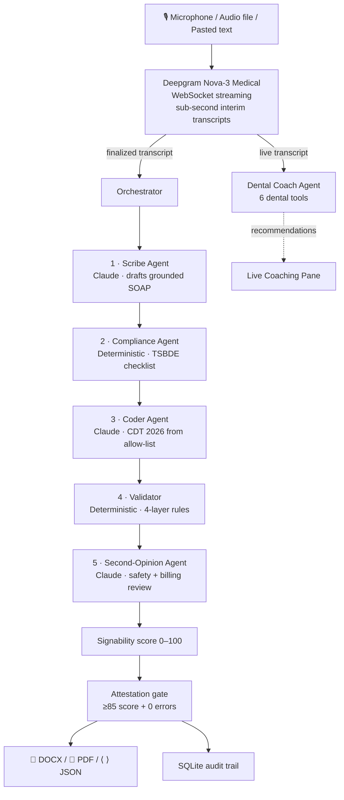

# DentaScribe — Executive Brief

> **AI clinical scribe for dental practices.**
> Records the doctor–patient conversation, drafts a Texas-compliant SOAP note,
> codes the visit, flags safety risks, and lets the provider sign — all
> before the patient leaves the chair.

---

## At a Glance

- **What it is:** A 6-agent AI scribe, specialized for **dental** workflows (not generic medical).
- **Who it's for:** Independent practices, DSOs, and dental teaching clinics in Texas (compliant out-of-the-box) — model extends to any US state.
- **Time saved:** Eliminates the **25–40% of clinical time** dentists spend on charting today.
- **Quality:** Every clinical claim quotes the transcript verbatim — **anti-hallucination is the product, not a feature**.
- **Compliance:** Generates records that satisfy **TSBDE 22 TAC §108.8** anchor block on every visit.
- **Unit economics:** ≈ **$0.15–0.30 per consultation** in API costs. Marketable price point: $200–500 per provider per month.
- **Status:** Working MVP. **102 automated tests pass.** End-to-end live recording proven on real audio. Ready for pilot deployment.

---

## The Problem

- **Dentists spend ~30% of their day on documentation**, not on patients.
- **Existing scribes are medical-focused** — Suki, Abridge, Heidi were built for primary care, not dental terminology (CDT codes, Universal tooth numbering, periodontal staging).
- **CDT mis-coding is a top liability** in dental insurance billing — every uncoded or wrongly-coded procedure is lost revenue or an audit risk.
- **TSBDE record-keeping rules are strict** (22 TAC §108.8) and current EHRs don't automate compliance.
- **Safety oversights persist** — drug interactions (NSAID + ACE inhibitor), missed allergy histories, contraindicated procedures slip through busy days.

---

## Our Solution

- **A 6-agent swarm**, not one big LLM call. Each agent has a single, bounded job.
- **Three input modes**: paste a transcript, drop in audio, or record live via a phone or laptop browser (WebRTC mic).
- **Live coaching pane** during the consultation — flags drug interactions, history gaps, and CDT codes accumulating in real time.
- **Texas-compliant signed SOAP** out the other end — printable Word + PDF with provider signature block, AI-disclosure footer, and the 9-point TSBDE checklist.
- **Two-layer review** — every note is drafted by Claude, peer-reviewed by a Second-Opinion agent for safety + billing gaps before the dentist signs.

---

## Workflow — from operatory to signed chart

```
   ┌─────────────────┐    ┌─────────────────┐    ┌─────────────────┐
   │ 1. CAPTURE      │ →  │ 2. SWARM         │ →  │ 3. COACH (live)  │
   │ Live mic /      │    │ Scribe writes    │    │ Drug interaction │
   │ upload audio /  │    │ SOAP grounded    │    │ history gaps     │
   │ paste text      │    │ in transcript    │    │ diagnostic tests │
   └─────────────────┘    └─────────────────┘    └─────────────────┘
            │                       │                       │
            ▼                       ▼                       ▼
   ┌─────────────────┐    ┌─────────────────┐    ┌─────────────────┐
   │ 4. REVIEW       │ →  │ 5. ATTEST       │ →  │ 6. EXPORT       │
   │ 6 tabs:         │    │ Signability     │    │ DOCX  · PDF     │
   │ SOAP·Codes·     │    │ gate (≥85 + 0   │    │ JSON for PMS    │
   │ Tooth chart·    │    │ errors). Doctor │    │ Audit trail in  │
   │ Audit · Cost    │    │ signs.          │    │ SQLite / RDS    │
   └─────────────────┘    └─────────────────┘    └─────────────────┘
```

**Time per encounter:** ~60 seconds from "Stop recording" to "Signed PDF in hand."

---

## Architecture — the 6-agent swarm



### Why this is safer than a single LLM call

- **Anti-hallucination:** every clinical claim quotes a transcript span. Validator rejects ungrounded notes before the doctor sees them.
- **CDT codes are constrained:** the Coder picks from a sealed allow-list. It cannot invent codes.
- **Compliance is deterministic:** the TSBDE checklist is computed from facts, not asked to an LLM. No audit-trail surprises.
- **Two independent LLMs review:** Scribe writes, Second-Opinion peer-reviews. Disagreements are flagged before sign-off.

---

## What Makes Us Different

| | Generic medical scribes | **DentaScribe** |
|---|---|---|
| **Specialty fit** | Primary care; no dental vocabulary | Dental-tuned: CDT 2026, Universal numbering, periodontal staging |
| **CDT coding** | Manual or none | Automated, allow-list constrained, surface-aware (composite 1→2→3→4 surfaces) |
| **Compliance** | HIPAA-aware in general | Texas TSBDE 22 TAC §108.8 enforced on every chart |
| **Live coaching** | Post-visit summarization only | Real-time recommendations during the consultation |
| **Hallucinations** | Trust the LLM | Validator rejects ungrounded notes |
| **Cost** | $300–600/provider/month | Compute cost ~$0.15–0.30/visit → competitive at $200–400/month |

---

## Tech Stack

| Layer | Choice | Why |
|---|---|---|
| **Application** | Python 3.11 · Streamlit | Rapid clinical-UX iteration; deploys anywhere |
| **Primary LLM** | Anthropic Claude Sonnet 4.5 | Strong clinical reasoning; native tool-use; BAA-eligible on Enterprise |
| **STT (live)** | Deepgram Nova-3 Medical, WebSocket | Medical-tuned model, sub-second interim transcripts, diarization, BAA on paid plans |
| **STT (batch)** | Deepgram REST | Uploaded audio path |
| **TTS (demo)** | ElevenLabs Turbo v2.5 + OpenAI TTS fallback | Two-voice realism for sales demos |
| **Audio I/O** | streamlit-webrtc + PyAV resampler | Normalizes browser audio to 16-bit mono 16 kHz for any mic |
| **Audio DSP** | scipy + noisereduce | High-pass filter + spectral-gating denoise + loudness normalization |
| **Schema validation** | JSON Schema Draft-07 + jsonschema | Every LLM SOAP output validated structurally |
| **Documents** | python-docx + reportlab | Clinical-grade DOCX + paginated PDF with provider signature |
| **Persistence** | SQLite (MVP) → Postgres + BAA (production) | Encounters · transcripts · SOAP versions · audit log · attestations |
| **Test harness** | pytest | 102 automated tests across foundation, agents, audio, exports, coach |

---

## Compliance & Trust

- **TSBDE 22 TAC §108.8 anchor block** computed on every chart: patient ID, provider license #, date of service, history, CC, diagnosis, plan, materials, consent flag, radiograph reference, anesthetic record, provider signature.
- **Retention enforced** by code: adult 5 years from last DOS; minor → age of majority + 5 years. Admin-confirmed two-step purge — never auto-deletes.
- **AI-assisted disclosure** stamped on every exported chart: *"This SOAP note was drafted by DentaScribe (an AI-assisted clinical scribe) and reviewed by the signing provider before signature."*
- **Sign-off gated by quality:** the attestation block locks until the signability score is ≥85 and zero structural errors remain.
- **HIPAA production path** (next 30 days): SQLCipher / Postgres-with-BAA, PHI de-identification pre-LLM, BAA from Anthropic + Deepgram + ElevenLabs, TLS everywhere, audit log on every state mutation. **All pieces exist; ops wiring required.**

---

## Unit Economics

```
┌─────────────────────────────────────────────────────────┐
│  Per-consultation compute cost (Live mode)              │
├──────────────────────────────────────┬──────────────────┤
│  Scribe — draft SOAP                 │  $0.030          │
│  Compliance — deterministic          │  $0.000          │
│  Coder — CDT codes                   │  $0.008          │
│  Validator — deterministic           │  $0.000          │
│  Second-Opinion — peer review        │  $0.026          │
│  Subtotal (swarm)                    │  $0.064          │
├──────────────────────────────────────┼──────────────────┤
│  Deepgram Nova-3 Medical · 5 min     │  $0.050          │
│  Live Coach · 5-8 calls × $0.02      │  $0.10 – $0.20   │
├──────────────────────────────────────┼──────────────────┤
│  TOTAL PER LIVE CONSULTATION         │  $0.21 – $0.31   │
└──────────────────────────────────────┴──────────────────┘
```

**At $300/provider/month and ~20 visits/day × 22 working days = ~440 visits/month:**
- Cost: 440 × $0.25 = **~$110/month per provider**
- Margin: **~$190/month per provider** at the entry price point
- 100-practice DSO with 3 providers each ≈ **$900K ARR · $570K gross margin**

---

## Status — What's Live, What's Next

### ✓ Live in MVP

- 6-agent swarm operating end-to-end
- Live audio capture via WebRTC → Deepgram WebSocket → real-time transcript on screen
- Live Coach agent firing on speaker turn change or every 15 seconds
- Two locked demo cases pass at 100 signability (emergency endo, recall hygiene)
- DOCX + PDF SOAP exports with branded header, attestation block, audit footer
- TSBDE checklist enforced
- Per-agent cost telemetry shown in the UI
- Cross-provider verification (Anthropic + Deepgram + ElevenLabs all working)
- 102 unit tests, 5 git commits per day of build history

### ⚠ Next 30 days (pre-pilot)

- HIPAA layer: SQLCipher / Postgres + BAA, PHI de-identification pre-LLM
- OIDC auth + roles (doctor / hygienist / admin)
- TURN server for clinical-Wi-Fi WebRTC
- Per-practice multi-tenancy
- Token budget caps (no $5 surprise consultations)

### 🎯 Next 90 days (post-pilot)

- Full ADA CDT 2026 catalog (licensed embedding search)
- pyannote 3.1 diarization for higher accuracy on noisy operatory audio
- Insurance code cross-walk (CDT ↔ CPT for sleep apnea, oral surgery)
- Practice-specific coach tuning
- Mobile app shell (Streamlit on phone Safari works today; native wrapper next)

---

## The Demo (5 minutes, end-to-end)

1. Open the app → **🩺 Record** → **🎤 Live mic** tab.
2. Click **START** → speak a 30-second dental exchange (the script is in the demo prompts).
3. Watch the right pane: words appear as you speak. The left pane fires recommendations live — drug interactions, diagnostic tests to consider, codes accumulating.
4. Click **🛑 Stop & finalize**. 5 agents run on YOUR recording.
5. Result tabs populate: SOAP · Recommendations · Second-Opinion · Tooth chart · Audit & Cost.
6. **📤 Export** → download a printable, signed-ready SOAP DOCX.

**Total elapsed time: ~60 seconds from end of speech to signed PDF.**

---

## Contact + Links

- **Live app:** `https://<your-streamlit-cloud-url>`
- **Source:** <https://github.com/git-bonda108/DentaScribe>
- **Engineering handoff:** [HANDOFF.md](./HANDOFF.md)
- **Workflow walkthrough in-app:** sidebar → **💡 How it works**

---

*Texas-built. Dentist-reviewed. Compute-priced for the long tail.*
